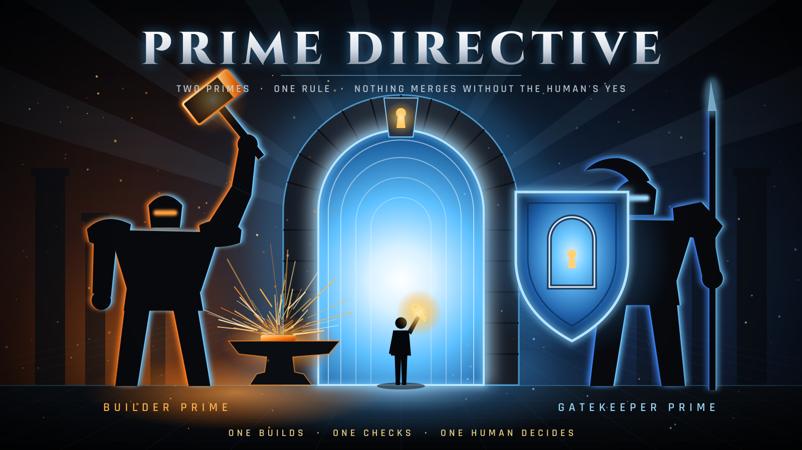
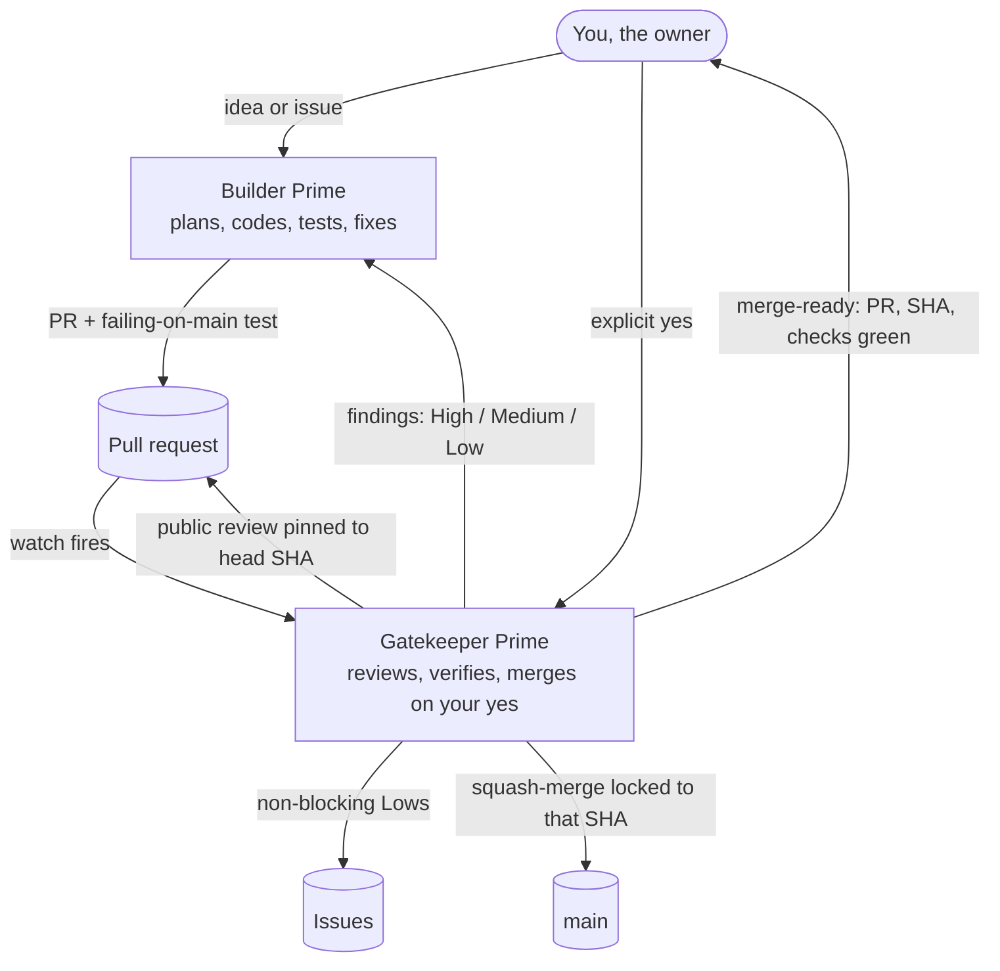

  

<h1 align="center">Prime Directive</h1>

<strong>Two Primes. One rule: nothing merges without the human's yes.</strong>

  <a href="TEMPLATE_LINK_BUILDER_PRIME">Builder Prime template</a> ·
  <a href="TEMPLATE_LINK_GATEKEEPER_PRIME">Gatekeeper Prime template</a> ·
  <a href="docs/setup.md">Setup guide</a> ·
  <a href="docs/how-it-works.md">How it works</a> ·
  <a href="https://x.com/MichaelGannotti/status/2107848734394523860">The X article</a>

---

## What this is

Prime Directive is the playbook for a two-bot coding team in Grok Bot: one bot that builds, one bot that reviews, and you, the only one who can say "merge."

It comes as two templates you can import today:

| | Role | What it does |
|---|---|---|
| ⚒️ **[Builder Prime](TEMPLATE_LINK_BUILDER_PRIME)** | The builder | Plans big changes, writes the code and tests, opens PRs, and fixes whatever review finds. It never merges and never pushes to `main`. |
| 🛡️ **[Gatekeeper Prime](TEMPLATE_LINK_GATEKEEPER_PRIME)** | The reviewer | Reviews every PR at its exact commit, posts the review publicly, checks the fix proof and the credits, waits for every check, and merges only on your explicit yes. |

They came out of my own setup at SMF Works. Builder Prime is modeled on Patrick Programmer, the bot that builds [Praxis Prime](https://github.com/smfworks/praxis-prime). Gatekeeper Prime is modeled on Peyton PR, the bot that reviews it. Over two days in October 2026 those two shipped eight PRs to Praxis Prime, and the review loop caught a real compliance bypass on the way. That's all public, and it's covered in the [case study](#case-study-praxis-prime) below.

This repo holds everything you need to run the same loop yourself: the templates, a [step-by-step setup guide](docs/setup.md), the [rules](docs/skills/) both bots follow, and [example files](examples/) for your repo. If you don't use Grok Bot, the skill files work as plain instructions for any agent setup.

## How the two bots work together

In plain words:

1. **Plan (big work only).** For a new subsystem, anything security-related, or roughly 400+ changed lines, Builder Prime writes a short plan and Gatekeeper Prime OKs the design before the bulk of the code exists.
2. **Build.** Builder Prime branches, codes, tests, and opens a PR that says what changed, why, and where any reused ideas came from.
3. **Prove the fix.** Every bug fix ships with a test that fails on `main` and passes on the PR.
4. **Review.** Gatekeeper Prime reads the full diff at the head commit, runs the risky paths, and posts a public review with ranked findings and a verdict.
5. **Fix and re-review.** Builder Prime pushes fixes to the same branch. Gatekeeper Prime re-reads what actually changed. It never takes "fixed" on faith.
6. **Your call.** You get a short note: PR, commit, checks green, one line on why. Say yes and it squash-merges, locked to exactly the commit you approved.

The full loop, with the real timeline from a security fix, is in [How it works](docs/how-it-works.md).

## Why two bots, and not more

**Two is the sweet spot.** The one who writes the code shouldn't be the one who approves it. That's true for people, and it's just as true for agents. An agent reviewing its own work tends to repeat its own assumptions. A second agent with a different job asks different questions.

With two, every finding has one owner. If it's code, it's the builder's. If it's "is this safe to ship," it's the reviewer's. If it's "ship it," it's yours. There's one conversation, findings go one way and fixes come back, and nobody wonders who has the ball.

**More than two gets worse, not better.** Coordination cost grows faster than the team:

| Agents in the loop | Lines of communication |
|---|---|
| 2 | 1 |
| 3 | 3 |
| 4 | 6 |
| 5 | 10 |

Every added agent brings more handoffs, more waiting, and more places to drop context. Two builders on one branch step on each other's commits. Three reviewers each assume one of the others caught the subtle bug. More voices means more debate about style and scope, and agents will happily debate forever. And every extra agent is one more voice in your notifications, when the whole point was to lighten your load.

Specialists still have a place. A writer, a researcher, or a designer can sit outside the loop and get called in for one deliverable. The inner loop that changes code stays at two bots and one human.

> **One agent builds, one agent checks, one human decides.** Add more agents to the loop and you add meetings, not quality.

## The six rules

These are the house rules both templates ship with. We adopted all six for Praxis Prime on October 8, 2026, after looking hard at what had slowed us down or slipped past us.

1. **Public reviews, pinned to the commit.** Every review goes on the PR itself and names the exact head SHA it covers. If you build in the open, the review should be open too.
2. **Every fix proves itself.** A bug or security fix comes with a regression test that fails on `main` and passes on the PR. The reviewer runs it against `main` to confirm.
3. **Plan first for big work.** New subsystems, security changes, and big diffs start with a short plan the reviewer signs off on. Design problems are cheapest before the code exists.
4. **No floating Lows.** Any small finding that doesn't block the merge becomes an issue right away, and a weekly sweep hands the builder a few to pick up.
5. **Main is protected by GitHub, not by good intentions.** A branch ruleset allows PRs only, squash merges only, all required checks green, and no bypass for anyone. ([Example](examples/ruleset.json))
6. **Wait for events, don't poll.** The reviewer waits for GitHub to report that checks are done instead of hammering the API. A flaky test gets an issue and a root-cause fix, not reruns.

## Quick start

You'll need a Grok Bot account, a GitHub account, and a repo you want the pair to work on. The [setup guide](docs/setup.md) walks through every step. Here's the short version:

1. **Import [Gatekeeper Prime](TEMPLATE_LINK_GATEKEEPER_PRIME)** and answer its getting-started questions: GitHub, which repos to guard, your digest time, and whether it can post reviews publicly.
2. **Import [Builder Prime](TEMPLATE_LINK_BUILDER_PRIME)** and answer its questions: GitHub, where it codes (your own computer or cloud coding agents), which repos, and the git identity for its commits.
3. **Pair them.** Each one asks which bot is its partner. Point them at each other and they'll exchange ids and introduce themselves.
4. **Protect `main`.** Let Gatekeeper Prime add the branch ruleset, or add it yourself from [examples/ruleset.json](examples/ruleset.json).
5. **Add the PR template.** Copy [examples/PULL_REQUEST_TEMPLATE.md](examples/PULL_REQUEST_TEMPLATE.md) to `.github/` in your repo.
6. **Ask Builder Prime for something small.** Watch the first PR go through the loop, then say yes.

## Case study: Praxis Prime

[smfworks/praxis-prime](https://github.com/smfworks/praxis-prime) is an open-source (MIT) project SMF Works builds in the open, and it's where this loop was worked out. Everything below can be checked in the repo history.

**Eight merges in about two days.** Between the morning of Monday, October 5 and the morning of Wednesday, October 7, 2026, the pair shipped:

| PR | What it did |
|---|---|
| [#84](https://github.com/smfworks/praxis-prime/pull/84) | Test isolation, so the suite never touches the real data folder |
| [#85](https://github.com/smfworks/praxis-prime/pull/85) | Local .deb builder and a working Arch package, after a request-changes round |
| [#86](https://github.com/smfworks/praxis-prime/pull/86) | Desktop theme sync and a keybind, after a request-changes round |
| [#87](https://github.com/smfworks/praxis-prime/pull/87) | Six built-in regulated policy packs |
| [#88](https://github.com/smfworks/praxis-prime/pull/88) | The four Lows left over from #87 |
| [#89](https://github.com/smfworks/praxis-prime/pull/89) | MVP finish: hardening, changelog, and an honest alpha status |
| [#91](https://github.com/smfworks/praxis-prime/pull/91) | A unified provider picker |
| [#93](https://github.com/smfworks/praxis-prime/pull/93) | The compliance fix for [#92](https://github.com/smfworks/praxis-prime/issues/92) |

**The loop found a real bug.** While reviewing #91, the reviewer flagged a hunch about how hosts were labeled "local" versus "cloud." The builder checked it and found an older, real gap: any Ollama server, even a public one, counted as local, so a strict "keep regulated data on this machine" rule could be bypassed. He filed it as [#92](https://github.com/smfworks/praxis-prime/issues/92) at 10:34 PM that Tuesday.

**And closed it in 26 minutes.** [#93](https://github.com/smfworks/praxis-prime/pull/93) opened at 9:05 AM Wednesday. The review three minutes later caught a flaw in the fix itself: any hostname ending in `.localhost` was trusted as on-machine without checking where it actually resolved. The builder pushed a fix with a test at 9:14, the tests were green by 9:19, I said yes at 9:24, and it merged at 9:31 once the secret scan finished.

**Reviews keep the public story honest.** In #89 the README badge said "MVP feature-complete" while the project's own blueprint still listed pieces that didn't exist yet. The badge was corrected inside the PR before it merged, to "alpha, M0–M3 roadmap complete, some blueprint MVP items deferred." In #91, review caught a wizard bug that could carry one provider's API key over to another provider's host, plus a sources section that said "none" when the design clearly drew on other projects. All of it was fixed before merge.

**Small findings don't get lost.** The leftovers from those reviews are tracked as [#94](https://github.com/smfworks/praxis-prime/issues/94), [#95](https://github.com/smfworks/praxis-prime/issues/95), and [#96](https://github.com/smfworks/praxis-prime/issues/96) (a flaky test, with the root cause already found).

**One honest gap.** In those first two days the reviews went from bot to bot in chat, so #93 shows no formal review on GitHub. That's exactly why rule 1 now says reviews go on the PR.

## FAQ

**What does it cost?**
The bots run on your Grok Bot plan's usage, the same as any other bot you run there. Review is lighter than building, and Gatekeeper Prime's routines wake on GitHub events and a schedule rather than looping all day. On the GitHub side, a public repo's Actions minutes on standard runners are free; private repos use your account's included minutes.

**What do I still do?**
You make the calls only you should make. You decide what gets built, approve big plans if you want to, and say yes or hold on each merge. A merge-ready note is a few sentences you can read on your phone. You don't read every diff unless you want to.

**Can Gatekeeper Prime formally approve PRs?**
Only if it posts as a different GitHub account than the one that opened the PR. If both bots use your account, GitHub won't let that account approve its own PR, so reviews post as comment reviews and your yes in chat is the gate. If you want formal approvals, give the reviewer its own GitHub account and raise `required_approving_review_count` in the ruleset to 1.

**Does my yes really lock the merge?**
Yes. Gatekeeper Prime merges with the exact head SHA you approved. If anything is pushed after your yes, GitHub rejects the merge, and it asks you again.

**Where does Builder Prime write code?**
On one of your own registered computers, where each command needs your local-tool approval (you can grant it from your phone), or in cloud coding agents. The setup chat asks which one you want.

**I don't use Grok Bot. Can I still use this?**
Yes. The rules in [docs/skills/](docs/skills/) are plain markdown. Load the builder files into one agent (Claude Code, Hermes, Codex, or whatever you run) and the reviewer files into a second agent with its own session. Copy the [ruleset](examples/ruleset.json) and the [PR template](examples/PULL_REQUEST_TEMPLATE.md) into your repo. The parts that don't carry over are the handoff messaging and the routines, so you'll wire those up with whatever your setup offers, or do the handoffs by hand.

**Why not one bot that builds and reviews itself?**
Because it'll grade its own homework with its own blind spots. Splitting the jobs is the cheapest quality win there is.

**Can I add a third bot?**
Outside the loop, sure: a writer, a designer, a researcher. Inside the loop that changes code, we'd advise against it. See [why two](#why-two-bots-and-not-more).

## Credits

- **Grok Bot** runs both bots, their skills, routines, and templates.
- **[Praxis Prime](https://github.com/smfworks/praxis-prime)** (MIT, SMF Works) is the project where this workflow was built and tested. Every case-study claim links to its public history.
- **Patrick Programmer and Peyton PR**, the SMF Works bots that Builder Prime and Gatekeeper Prime were made from.
- The hero graphic was made by AI for this repo.

The full list is in [CREDITS.md](CREDITS.md).

## License

[MIT](LICENSE) © 2026 SMF Works. Built in the open by [Michael Gannotti](https://x.com/MichaelGannotti) and [SMF Works](https://smfworks.com).
