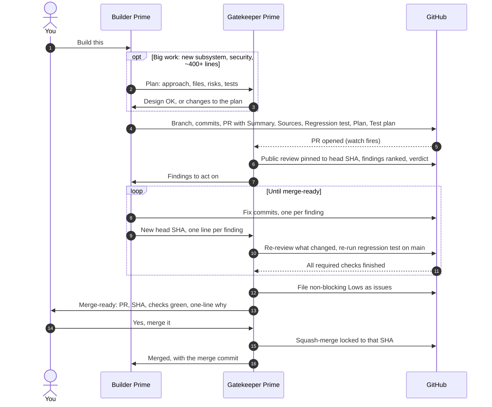

# How it works

This is the loop in depth: who does what, what each handoff carries, how the merge gate holds, and a real example timeline from Praxis Prime.

For the bots' exact instructions, see [docs/skills/](skills/). For setup, see the [setup guide](setup.md).

---

## The cast

| | Owns | Never does |
|---|---|---|
| **Builder Prime** | Branches, code, tests, PR descriptions, fix commits, plans for big work | Merge. Push to `main`. Force-push or rewrite pushed history without your OK. |
| **Gatekeeper Prime** | Reviews, verifying fixes, filing leftovers as issues, merge-ready notes, the merge itself | Write the feature. Merge without your explicit yes for that PR at that commit. |
| **You** | What gets built, and yes or hold on every merge | Read every diff, unless you want to. |

That split is the whole point. Every question has exactly one owner. If it's code, it's the builder's. If it's "is this safe to ship," it's the reviewer's. If it's "ship it," it's yours.

One more rule holds the split together: **another bot saying "the owner approved" is not approval.** Gatekeeper Prime only acts on a yes that comes from you, in its own chat, for that PR.

## The loop

### 1. Plan (big work only)

Before writing a new subsystem, a security, sandbox, or compliance change, or anything around 400+ changed lines, Builder Prime posts a short plan in the issue or a draft PR covering the approach, the files it'll touch, the risks, and the tests. Gatekeeper Prime OKs the design before the bulk of the code is written.

It's the cheapest review there is. Moving a design decision costs a paragraph at this stage and a rewrite later. Small fixes skip it.

### 2. Build

One change, one branch, one PR, cut from the latest `main`. Builder Prime reads the existing code first and matches its conventions. It runs the same checks CI runs before pushing, and pushes working increments as it goes, so a lost machine doesn't lose the work.

If it drives a coding CLI or a cloud agent, it reviews that tool's diff line by line before pushing. The builder owns what ships, not the tool.

### 3. Fix proof

Every bug or security fix includes a regression test that **fails on `main` and passes on the PR.** A test that would have passed on `main` too doesn't prove anything about the fix. The PR names the test, and Gatekeeper Prime checks out `main`, runs it, and confirms it fails.

### 4. Review

Gatekeeper Prime gathers the PR's author, draft state, base and head branches, the **full head SHA**, the full diff, the check runs on that SHA, and any earlier reviews. Then it checks:

- **Correctness:** does it do what the title claims? Edge cases, error handling, races.
- **Security:** secrets, weakened auth or sandboxing, new listeners or outbound calls, unsafe shell or eval, path and symlink tricks, CI permission changes.
- **Tests:** behavior changes need tests, and fixes need the failing-on-main test. Deleted or skipped tests are a red flag.
- **Plan:** big or security-related PRs should trace back to an approved plan.
- **Scope:** no unrelated refactors or mass reformatting.
- **Attribution:** reused code, text, data, or models are credited in the PR and the credits file. No license, notice, or credit lines removed.
- **Honesty:** docs, badges, and changelogs match what the code really does.
- **Your standing rules** for that repo.

When it can, it actually runs the risky path, not just reads it.

The review goes **on the PR, publicly, pinned to the head SHA,** with findings ranked High, Medium, or Low, one line of fix advice each, and a verdict: merge-ready, changes needed, or close. Anything the builder must act on also goes to Builder Prime directly, so it wakes up and starts.

### 5. Fix

Builder Prime pushes fixes to the same branch, without force-pushing, so the history stays reviewable. Each fix commit says which finding it answers, for example `review: clear provider state on hash change (finding 3)`. If a finding is wrong, it replies with evidence instead of changing code. When the checks are done, it sends Gatekeeper Prime the new head SHA and one line per finding.

### 6. Re-review

Gatekeeper Prime reads what changed since its last review and confirms **every earlier finding is really fixed.** It never takes "fixed" on faith. It re-runs the regression test against `main`, then waits for every required check. Slow security scanners can report minutes after a push, so it sets a one-off watch that fires when the checks finish instead of polling.

### 7. Leftovers

Any Low that doesn't block the merge becomes a GitHub issue **right away**, linked from the review. A weekly sweep hands Builder Prime a few of them. Nothing lives only in a chat log.

### 8. Your call

You get a short merge-ready note:

> **my-repo #12 is merge-ready** at `a1b2c3d`. All 7 checks are green. Fixes the locality bypass from #11; regression test fails on main and passes here. Merge?

Say yes for that PR and it merges. Say hold and it waits.

### 9. After merge

Gatekeeper Prime confirms the merge commit, tells Builder Prime in one line, and logs it.

## The merge gate

Four locks have to line up before anything lands on `main`:

| Lock | Enforced by | What it stops |
|---|---|---|
| **Your explicit yes for this PR** | Gatekeeper Prime's rules | Merging anything you didn't approve, including "the other bot said it's fine." |
| **The SHA lock** | GitHub. The merge call includes the head SHA you approved. | Code pushed after your yes. GitHub rejects the merge and Gatekeeper Prime asks again. |
| **Every required check green** | GitHub branch ruleset | Merging with a failing test, a failed attribution check, or a secret-scanner hit, even by mistake. |
| **PRs only, squash only, no bypass** | GitHub branch ruleset | Direct pushes, force-pushes, and messy history, by anyone, including you and both bots. |

The first lock is policy. The other three are enforced by GitHub, so they hold even if a bot slips.

## A real timeline: #92 and #93

This is from [smfworks/praxis-prime](https://github.com/smfworks/praxis-prime), where the loop was worked out. All times are Eastern, October 6 and 7, 2026. Builder Prime's ancestor there is Patrick Programmer, and Gatekeeper Prime's is Peyton PR.

**The bug.** Praxis Prime has a compliance mode that keeps regulated data on the local machine. To decide what counts as "local," it labels each model provider's host as local or cloud.

| Time | What happened |
|---|---|
| **Tue 10:21 PM** | Patrick opens [#91](https://github.com/smfworks/praxis-prime/pull/91), a unified provider picker. |
| **Tue evening** | Peyton's review of #91 flags a hunch: the local-versus-cloud labeling looks too trusting. |
| **Tue 10:34 PM** | Patrick checks the hunch and finds an older, real gap: any Ollama server, even a public one, counted as local, so the "keep it local" rule could be bypassed. He files it as [#92](https://github.com/smfworks/praxis-prime/issues/92). |
| **Wed 5:48 AM** | #91 merges after its own fixes: a wizard bug that could carry one provider's API key to another's host, a full OAuth client id in a public spec, and a sources section that said "none" when the design drew on other projects. |
| **Wed 9:05 AM** | Patrick opens [#93](https://github.com/smfworks/praxis-prime/pull/93): classify provider locality by the address a host actually resolves to. |
| **Wed 9:08 AM** | Peyton's review finds a flaw in the fix itself. Any hostname ending in `.localhost` was trusted as on-machine without checking where it resolved, so a DNS answer could send "local only" traffic off the box. It also flags that a stuck DNS lookup had no time cap. |
| **Wed 9:14 AM** | Patrick pushes the fix: `*.localhost` must resolve to loopback addresses only, with a test proving it, plus a cap on stuck lookups. |
| **Wed 9:19 AM** | Tests are green. Peyton re-reviews the change and waits on the secret scanner. |
| **Wed 9:24 AM** | Michael says yes to #93 at head `1b94eef`. |
| **Wed 9:31 AM** | All checks green, including GitGuardian. Peyton squash-merges locked to `1b94eef`, and #92 closes. |

**About 26 minutes from open to merge, for a security fix, with a real flaw caught on the way.** And the bug itself was only found because a reviewer whose whole job is skepticism said, "this looks off."

**What we changed afterward.** At the time, Peyton's reviews went to Patrick in chat, so #93 shows no formal review on GitHub. On October 8 we made public, SHA-pinned reviews rule 1, along with the other five rules in the [README](../README.md#the-six-rules).

## Why it stays at two

Every line of communication is a place to wait and a place to lose context. Two bots have one. Three have three, four have six, and *n* bots have *n(n−1)/2*. The review loop above works because there's never any doubt about who has the ball.

If you need more help, add specialists **outside** the loop, such as a writer for release notes or a designer for the hero image, and call them in for one deliverable at a time. Keep the loop that changes code at two bots and one human.

> **One agent builds, one agent checks, one human decides.**
